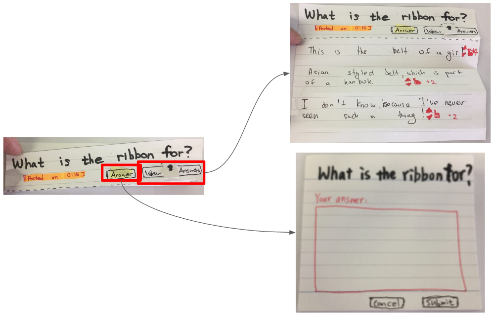

# Team K2T2 DP3

### Prototype

  - Video can be played by the computer by pulling paper strips
  
  - Asking a question with marking on the screen
  
  - Looking over other questions
  
  - Looking over other answers and answering questions
  
  - Rating answers by clicking arrows
  
### Participants
Total 3 participants

- P1
  - From Kazakhstan
  - Freshman in Kaist
  - Hobby is programming
- P2
  - From Korea
  - Junior in Mechnical Engineering, Kaist
- P3
  - From France
  - Master in Mathematics, Kaist

All of them answered to our short survey as follows

- Spend 1-2 hours a day watching online video
- (Almost) Never commented on those videos
- Usually they watch videos from other countries

### Briefing
Dear User,
Thanks for participating. We will show you a paper prototype of our project. We want you to test it by doing the tasks we will assign. Our project is about asking question for specific objects in a video. You can play/pause the video any time. You can ask a new question ,answer current questions or rate an answer. JongMin will keep the system working. You can also circle your object on the video just before asking. Jean will guide you so you can ask any questions to her. There are 3 tasks for you.

### Tasks
  - ***Task 1 : Ask a question***
  You will watch a video.  You can ask questions about any object in the video. After some time, other users will answer your question. You will get notified when you got a new answer for your question.
  - ***Task 2 : Answer a question***
  There are already some questions asked by other users. Please write an answer to any question.
  - ***Task 3 : Rate an answer*** 
  Some of the questions are already answered. You need to review an answer . Please like or dislike any answer.

### Observations
The critical level of each item is appended in bold at the end.

  - ***Theme A : Prototype cannot represent well***
 
  | Obervation | Solution |
  | ------ | ------ |
  | It took some time for (P1, P2, P3) to notice that the moving picture is a video. **Low** | This problem will be solved in computer prototype stage. |
    | P1 was not sure that manual rewinding the video is possible. **Low** | Make an explicit “thumb” on video progress bar.|
  - ***Theme B : Procedure problem***
    | Obervation | Solution |
    | ------ | ------ |
    | (P1, P2) watch whole video without any question so they rewind the video to find question. **Low** | We can prompt notification when the video is playing, or cut the video into shorter video clips. |
    | (P1, P2, P3) can not understand the question without seeing the marker on the scene for example ‘what is the ribbon for? **High** | We can put screenshot of the video frame with the annotation beside the question. |
  - ***Theme C : Affordance, Signifier problem***
    | Obervation | Solution |
    | ------ | ------ |
    | (P1,P2,P3) was not aware that he can click on the question and the related scene will appears on video. **Medium** | This problem is similar to next problem. So we can design the button for this function. |
    | Even if we add a ‘time’ button on the question which can redirect the video to the relevant frame, (P1, P2, P3) don’t realize it is clickable. But after the facilitator tell them they can click, they understand the question. **Low** | We can circle all the buttons with the special contour, for example a ‘blue contour’.	So that user will know all the clickable buttons. |
    | P2 didn’t realize that some question were already had answers. **Medium** | If it has no answers, make the color button white. If it has, fill it with some color(preferably yellow) |
    | P3 doesn’t know how to vote. **High** | We can make the vote button bigger. For example we can benchmark the ‘Like’ feature of Facebook. |
    | It’s hard to find which is clickable buttons(P1, P2, P3). **Medium** | We can circle all the buttons with the special contour, for example a ‘blue contour’. So that user will know the definition of a 'button'. |
    | P3 was confused by a toggle switch ‘see other questions’, which is supposed to show other questions on the video timeline. But P3 thought that is to toggle the questions beside the video. **Medium** | Remove the toggle. Put all a small mark on timebar for all previous questions. |

### Individual Reflection - Jean
I am the facilitator in three rounds. I found difficulties when the participants don’t understand the ‘paper prototype’. It is hard for them to get the right mental model on the paper prototype, especially when our design is deal with video which is really hard to present by papers. For example, they tried to manually pull the video tape instead of pressing play/pause button or rewinding the timebar. And our drawing video just contain random items, which is not a reasonable video, so participants felt hard to understand it and put much attention on it even though watching the video is not an important task in this experiment. We also have many affordance and signifier problem in our prototype. When I guided the participant to perform a task(e.g., answer a question), they didn’t know how to do it. So I had to point out the button, but I think that is not a good way to guide them. 
The paper prototype can transfer our idea more clearly. After the participants experienced whole process, they can imagine what might they do with the application. But the paper prototype is lack of feedback and instruction, so it’s hard for user to understand what they should do and were they doing right.

### Individual Reflection - Nuri
I am a observer guy in our team. I was observing all of the 3 participants during their interaction with a storyboards, by writing the report. During the interaction with participants, my plan was to achieve a good performance in making qualitative notes, so I was carefully examining a very little detail in their interaction. Sometimes, there were too many issues they were not comfortable about . So, I should have summarize all these in a bits of seconds not to forget it. Therefore, in situations when there was too many problems with UI,I was making short notes which were related to the specific problem and revising them later. Paper prototype was very important for user to see how our UI will look and what kind of interaction it will provide in the future. Our prototype covered all major parts, but it didn’t cover tiny details: most participants didn’t know which buttons were clickable, they couldn’t see ‘vote’ button and in some parts couldn’t understand the question.

### Individual Reflection - Jongmin
I was the computer in three rounds.
It was hard to anticipate what the user will do. It take a few rounds to be a real computer man. Furthermore there were some components missing during the tasks, for example new answer sheet with proper size should have been prepared but I cut new paper to give one to the user at the moment.
We got many minor things we didn’t considered before. For example the buttons we made was not noticeable enough and users didn’t explored our interfaces actively. There was a gap between what we expected and what the users actually did.
We need to approve our fidelity of feeling I think.

### Individual Reflection - Kamil
I was an observer in all 3 cases. Our paper prototype improved even after each participant. But some improvements were just to make it more pleasing. Jongmin had a hard time synchronizing both video and time bar. Observing them while keeping silent was hard. I felt like I should correct their mistakes or show them the way. But the purpose is to find UI problems. Another difficulty was having an abstract video. Our video was a bit complex with different objects. In a computer prototype we can provide a real video.
**Pros of Paper prototyping**: There is a facilitator user can communicate with. Layers can be shown easier. Popups or even a slight change is easily notified by the user. High fidelity in depth.
**Cons of paper prototyping**: Video playing is very hard. No sound effects. Every response is slower than computer response. Low fidelity in look & feel.

### Studio Reflection
We got three feedbacks from the presentation.
1. Users are not used to marking on timebar with Q marks, so it need more affordance.
2. Marking specific things, when the whole video is about different things.
3. Need background explanations for the users who are not familiar with asking questions (on online boards)

-> All feedbacks are about the affordance and learnability. We will use some effects like flikering or shining to every interative things (buttons, scrollbars, marks, etc.) to solve this problems.

